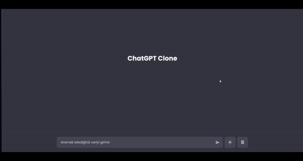

---

# ChatGPT Klon Uygulaması

Bu proje, HTML, CSS ve JavaScript kullanılarak geliştirilmiş bir ChatGPT klon uygulamasıdır. Kullanıcılar, metin giriş alanına sorgularını girer ve veritabanından API aracılığıyla alınan yanıtlar ekrana yazdırılır.

## Özellikler

- **Kullanıcı Sorgusu:** Kullanıcılar, metin kutusuna sorgularını girebilir.
- **API Entegrasyonu:** Kullanıcı sorgularına uygun yanıtlar almak için bir API ile veritabanına bağlanır.
- **Veri Gösterimi:** API'den alınan veriler ekranda gösterilir.
- **Dark/Light Mode** Tek simge üzerinden karanlık ve aydınlık modlar arasında geçiş yapma
- **Responsive Tasarım:** Farklı cihazlara uyumlu bir kullanıcı arayüzü.

## Ekran Görüntüleri


## Kurulum

Projeyi yerel olarak çalıştırmak için aşağıdaki adımları izleyin:

1. **Depoyu klonlayın:**
   ```bash
   git clone https://github.com/cengo14/javascript-chatgpt-clone-projectu.git
   ```

2. **Proje dizinine gidin:**
   ```bash
   cd javascript-chatgpt-clone-project
   ```

3. **API Anahtarını Ekleyin:**

   `main.js` dosyasına gidin ve API anahtarınızı ilgili değişkene atayın.

4. **index.html dosyasını bir tarayıcıda açın:**

   Projeyi başlatmak için `index.html` dosyasını bir tarayıcıda açın.

## Kullanım

1. Metin kutusuna sorgunuzu girin ve "Gönder" butonuna tıklayın.
2. Sorgunuza uygun yanıtlar, veritabanından API aracılığıyla alınır ve ekranda gösterilir.
3. Yeni sorgular girmek ve daha fazla bilgi almak için adımları tekrarlayın.

## Katkıda Bulunma

Katkılarınızı memnuniyetle karşılıyoruz! Herhangi bir hata bulursanız veya geliştirme öneriniz varsa, lütfen bir **Issue** açın veya bir **Pull Request** gönderin.

## Lisans

Bu proje MIT lisansı altında lisanslanmıştır. Daha fazla bilgi için [LICENSE](LICENSE) dosyasına bakın.

---

